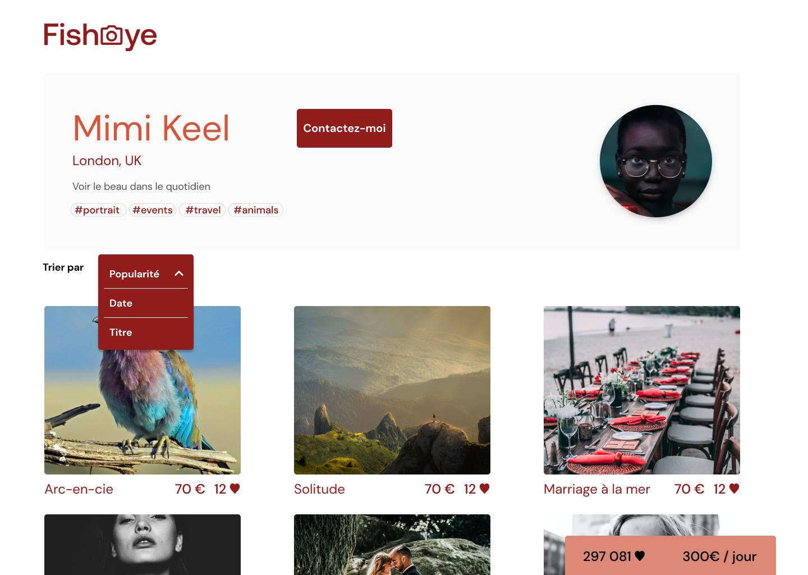

# FISHEYE
### Platform for freelance photographers with accessibility support
---

    

---

---
#### STACK
- HTML5/CSS3
- Vanilla Javascript (Modular & object oriented)
- Webpack
- Sass (+BEM methodology)

#### Tools
- AChecker
- Screen readers

----

### Prerequisites

- [NodeJS](https://nodejs.org/en/)
- [Yarn](https://yarnpkg.com/)

<small>[ If you are working with several versions of NodeJS, we recommend you install [nvm](https://github.com/nvm-sh/nvm). This tool will allow you to easily manage your NodeJS versions. ]</small>

----
### Launching the project
- Fork the repository
- Clone it on your computer.
- The `npm i` command will allow you to install the dependencies.
- The `npm run start` command will allow you to run the micro API.
----
----
#### ROADMAP TO FISHEYE APP CREATION
----

### <b>A Component-based structure</b>

The app is essentially composed of 
- <b>2 main models of pages</b> : 
Homepage and photographer page. 

- <b>2 secondary modal pages</b> accessible from the photographer page:
contact modal / lightbox gallery modal

There is only  <b>one homepage</b>, where a <b>list of photographers profiles</b> is displayed,
then there is <b>one photographer page per photographer</b>.

<b>HOMEPAGE PROCESS</b>

- When the user opens homepage, a call to the api is made, to retrieve the whole list of photographers.
- <b>For each photographer of the list</b>:
    - A 'photographer component' will be generated 
         - using a factory,
        - which is provided itself with a <b>model of the photographer object</b> (class photographer-model.js).
    - The generated 'photographer component' will then be <b>injected the data from the api </b>(photographer name, photographer location, etc).
    - The 'photographer component also contains a html template
    - The whole component will be rendered : html template + data

- Alternative to the default homepage view = if the user clicks on one of the navigation tags ("portrait", "paysage", .. ):
    - The photographers list <b>previously retrieved from api</b> 
    will get through a <b>filter function</b>
    - to display only the photographers whose 'tagsList' contains the clicked item (i.e : if 'portrait' clicked, display only photographers with a 'portrait' tag)

<b>PHOTOGRAPHER PAGE PROCESS</b>
- On the homepage, the user clicks on one photographer's profile
- that redirects to the photographer's own page
- The photographer's page uses the <b>same data as homepage</b> (photographer name, photographer location, etc)
- And the <b>html template is also the same</b> 
- (the only differences relate to the style and so will be fixed by the scss part)

- => Therefore, the photographer's page is going to use the SAME PHOTOGRAPHER COMPONENT previously used and called by homepage, and then CACHED, to avoid another same call to api

- The photographer's page is going to need another chunk of informations though, 
    to display the photographer's images gallery.

- For that, it will have to make <b>it's own api call</b>, to retrieve the <b>'media' data </b>related to a photographer (containing photographer's photos, photo titles, videos, etc.)  
(-> <small>This is meant to avoid the initial api call for photographers list, to also retrieve all media data for each photographer (heavy :images/videos) then cached, and might not be needed (it's only needed if the user wants to see more about one photographer)</small>)

- Once the data is retrieved, a 'photographer gallery component' will be generated:
    - For each photo from photographer's gallery:
    - A 'photo component' will be generated
    - using a factoy
    - which is provided itself with a <b>model of the photo object</b> (class photographer-model.js).
     - The generated 'photo component' will then be <b>injected with the data from the api </b>(photo title, photo price, etc).
    - The 'photo component also contains a html template

    - The whole component will be rendered : html template + data
 
    - At this point, the whole photographer page is rendered, 

        ==> if the user clicks on a particular photo:

        - The lightbox modal opens
        - this component is a html template with it's own logic (auto-animation / accesibility features, ...), meaning its logic is independant from its parent
        - It displays the media data (photos gallery) called by its parent page  
    
        ==> if the user clicks on the 'contact me' button contained in the photographer profile infos:

        - The contact modal opens
        - It contains:  
            - some data passed by its parent: photographer name
            - a Form that the user will fill out

        - this component is a html template with it's own logic:
            - form validations, accessibility features, confirm close modal, ..  
            - it's <b>own call to an api</b> (mock here) to POST the form data retrieved from form
            - a final confirmation dialog box once the form data has been successfully submitted

<b>ADDITIONAL COMPONENTS</b>
- <b>1 'navtags' component</b> : the list of tags ('portrait', 'paysage', ..) that is used in different places through the app :
    - as a main navigation on homepage : triggers the sorting of photographers list
    - as a static list of tags inside a photographer's profile (both on homepage & photographer's page)

---

### <b>Routing</b>
The navigation will be taken care of by a proper router (instead of html inline href links)

---

### <b>Tools in use</b>

#### Webpack
The use of webpack here has 2 main purposes: 
 - ensure the cross-browsers compatibility
 - Give the project a frame that enables the component-based structure, with a strong decupling of responsabilities.

#### Sass
 In the same way, sass makes it possible to work in a modular manner, and optimize the code for reuse in different parts of the app.

 ---

